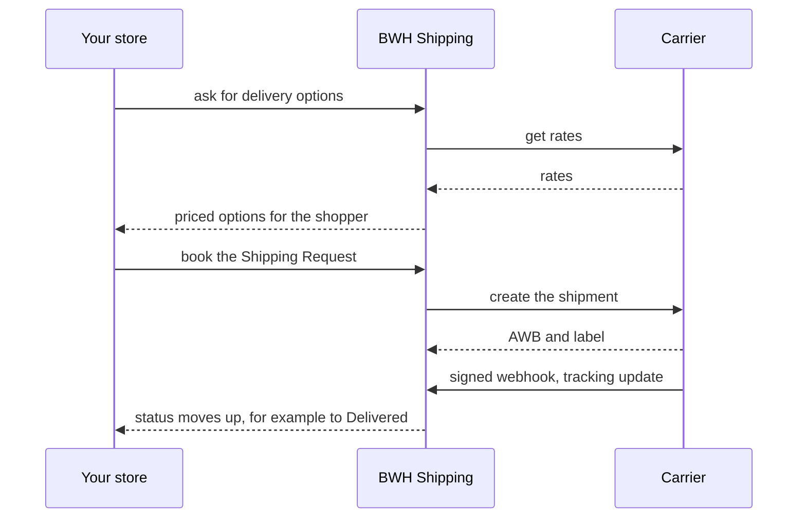

<div align="center" markdown="1">


<h1>BWH Shipping</h1>

<a href="https://buildwithhussain.com"></a>

**Shipping rates, labels and tracking for ERPNext**

<p>
	
	
</p>

</div>

BWH Shipping lets an ERPNext store quote delivery options at checkout, book shipments and track them,
using the same code for every carrier. Read the **[developer docs](https://bwhdocs.fsn.frappe.cloud/bwh-shipping/get-started/overview)**.

### Carriers

- **Shiprocket**: courier aggregator for domestic India, with pickups and manifests
- **AfterShip**: labels and tracking across hundreds of carriers worldwide

### Features

- Live carrier rates at checkout, with your own markup, handling fees and Shipping Rules
- Book a shipment and print its label from a Delivery Note
- Tracking updates from carrier webhooks, or on demand
- Pickups and manifests, where the carrier supports them
- A booking that fails part-way can be resumed without creating a second order
- Add your own carrier with one Python class

### How it works



### Installation

You need ERPNext, on Frappe 16 or later.

```bash
bench get-app https://github.com/bwhtech/bwh_shipping
bench --site your.site install-app bwh_shipping
```

Then [set up a carrier](https://bwhdocs.fsn.frappe.cloud/bwh-shipping/carriers/shiprocket) and
[connect it to your store](https://bwhdocs.fsn.frappe.cloud/bwh-shipping/get-started/use-it-in-your-app).

### Adding a carrier

Create a Single DocType in your own app, extend `ShippingProviderBase`, and implement `get_rates`,
`create_shipment`, `cancel_shipment`, `get_tracking` and `handle_webhook`. The
[step-by-step guide](https://bwhdocs.fsn.frappe.cloud/bwh-shipping/build/build-a-carrier) walks through it,
tests included.

### Development

```bash
bench --site test_site set-config allow_tests true
# once, on a fresh site: ERPNext's test records
bench --site test_site run-tests --lightmode --module erpnext.tests.bootstrap_test_data
bench --site test_site run-tests --app bwh_shipping
```

### Support

Found a bug or have a question? [Open an issue](https://github.com/bwhtech/bwh_shipping/issues).

## About BWH Studios

BWH Shipping is developed and maintained by BWH Studios, a tech company based in Jagdalpur, Chhattisgarh,
specializing in Frappe customizations and consulting.

#### License

MIT
